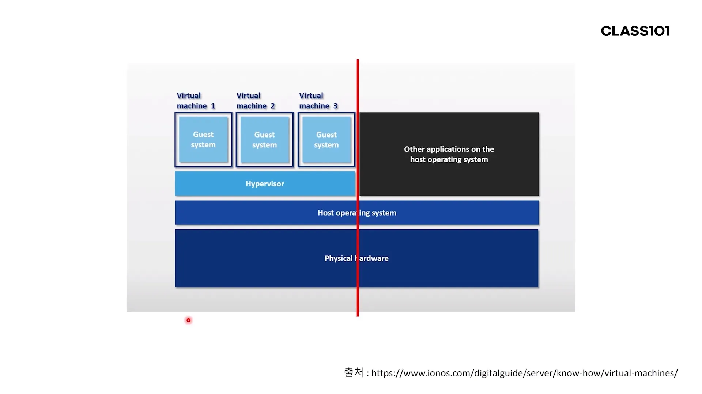
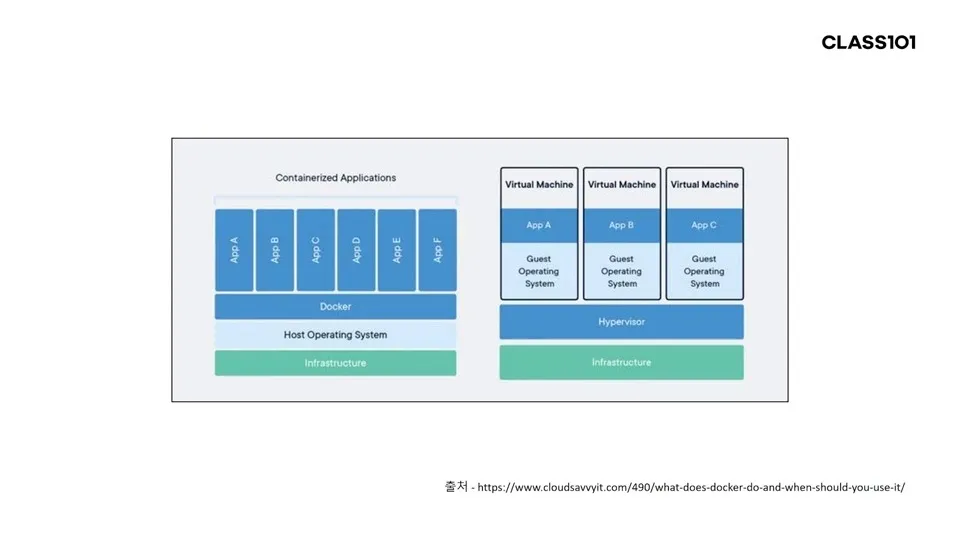

> Class101 "현직 대기업 개발자 푸와 함께하는 진짜 백엔드 시스템 실무"를 듣고 작성한 글입니다.
 
 목차
 ========================
- [준비사항](#준비사항)
  - [Cloud Platform(GCP)](#gcp)
  - [Docker](#docker)
- CPU bound Application
- 무중단 배포
  - 스트레스 테스트 툴로 성능 측정
  - Jenkins를 이용한 배포
- 배포 자동화와 협업을 위한 Git 사용
- 협업을 위한 Git 사용

#준비사항

>Docker 설치, GCP 계정

##GCP
- VM 인스턴스 : 한 물리 컴퓨터 위에 한 운영체제가 설치되어 있는 게 기본구조라면 
가상머신을 만들어주는 Hypervisor를 통해 한 물리적 컴퓨터 위에 여러개의 가상 운영체제를 띄울 수 있는데,
  이때 하나의 가상운영체제(Virtual Machine)는 __인스턴스__ 라고 부른다.

  
> GCP 가입은 [여기서](https://console.cloud.google.com/)  
 GCP 유료계정 활성화 안하면 과금되지 않는다고 하는데, 나는 뭘 잘못 누른건지 CPU bound app 올려놓고 냅두니까
> 한달 뒤 8천원 과금됐다 바보... 😭

Docker
--------------------------
- VM은 Host 운영체제 위에 독립적인 Guest 운영체제를 동작시키는데, 두 운영체제 사이에서 가상화 단계를 거치면서 오버헤드가 발생함
- 도커는 도커 위의 애플리케이션을 하나의 프로세스로 간주하여 리소스를 적게 활용하는 장점이 있음
- 도커는 IaC(Infrastructure as Code)를 따라 프로젝트 개발 인프라를 매번 설정할 필요 없이 자동으로 구성해줌
  (*고정된 IT 프로세스를 만드는 것은 유연하지 않기 때문에, 
  코드를 통해 VM 프로세스를 반복생성하고 자동으로 프로비저닝하는 IaC가 애자일 개발IAC에 이점을 가지고 있음*
  [참고문서보기](https://www.ciokorea.com/news/27915))

- 도커 설치는 
  
  